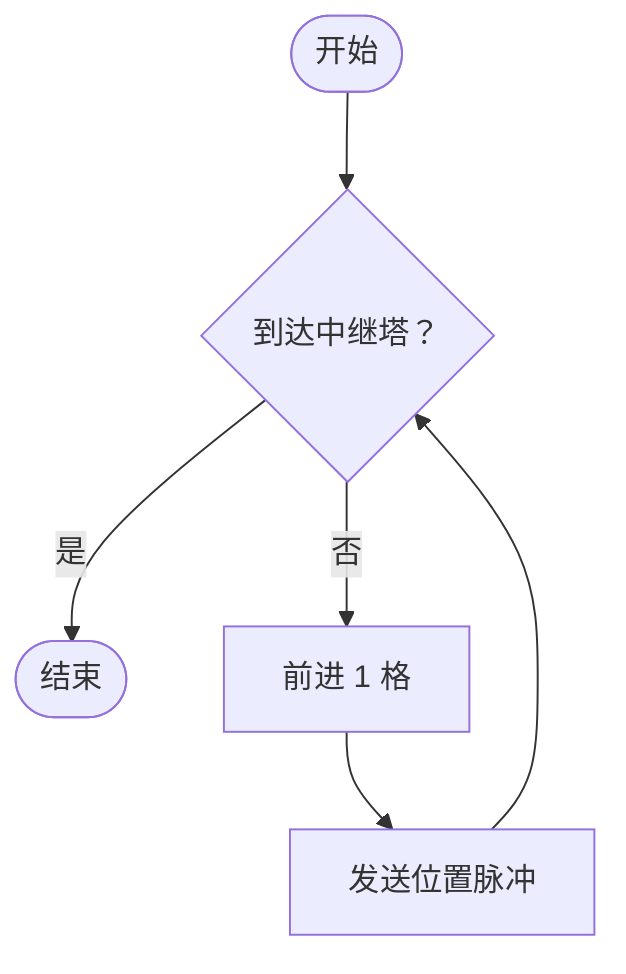
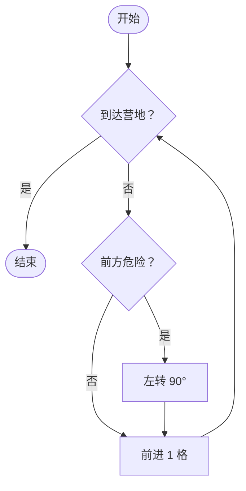
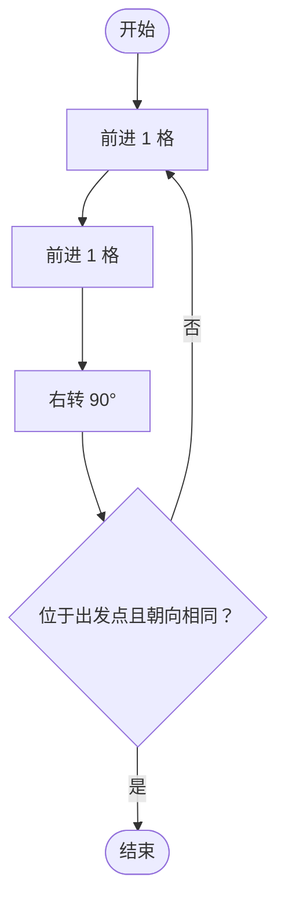

# 月球巡逻 · 飞控课堂：程序完整说明与试题要点

适用版本：**v1.4.0**。更新日期：2026 年 10 月 3 日。

这份说明对应 `loop-structure-lesson` 项目，用于备课、改 PPT、改教案和上课操作。课堂保留三个探究任务：建立中继通信、峡谷巡路、绕坑一圈。“寻找水冰”不再出现在本次课堂中，旧记录仍可读取。

## 1. 本版的课堂思路

学生先看清任务，再从空白画布搭建完整流程图，自己摆放开始、动作、判断和结束，自己连接箭头。方块可以重复使用，画错、漏线也可以运行。通过地图、运行文字和高亮节点，学生观察程序走到了哪里，再修改自己的方案。

三关页面不再显示预测卡片、停止条件下拉框、先判断/先执行切换按钮、“巡视方案 / 反复做什么，依据什么停止？”或判断时机对照卡。判断条件和动作一起放在积木区，学生直接拖入。实际连线决定执行顺序，方块的上下位置不决定执行顺序。

第一关重点是“一轮要完成哪些动作”和“怎样重复”；第二关重点是“走之前检查危险”和分支合流；第三关结合学生的不同方案，讨论判断放在动作前后会发生什么。第一、二关不要求学生围绕两种循环做机械对比。

可直接用于课堂的总任务说明：

> 今天你们是飞控顾问。请给巡视器画一张它看得懂的流程图。画好就试着运行，看看它能不能完成任务。走错了、停住了都没关系，找到原因，再改一次。

## 2. 学生端的页面与操作

学生入口是网站首页 `/`。选择教师已经开启的课堂、班级和姓名进入。可以一人一机，也可以两人一机；合作探究按小组保存，综合验收按个人提交。

每个探究页面上方显示任务情景和蓝底的大字号“任务目标”。左侧是地图、循环次数、动作数、剩余电量、模拟按钮和运行反馈；右侧是积木区和作图画布。

### 2.1 从空白画布作图

1. 把积木区的方块拖入画布。开始、结束、动作、判断都可重复拖入，程序不会预先替学生搭好框架。
2. 拖住方块中间移动位置。图形边缘的小方形标记是连线位置；从图形的上、下、左、右边缘拖到另一图形的边缘，就能连接箭头。
3. 判断节点的右侧、上侧默认拉出“是”分支，下侧、左侧默认拉出“否”分支。标签连反时，点击箭头，在旁边的工具中修改“是 / 否”。
4. 同一动作或开始节点重新连线，会替换它原来的下一步。判断节点重新连接同一个“是”或“否”分支，也会替换对应箭头。
5. 点击箭头，在画布内删除；也可以按 Delete 或 Backspace。点击节点后用旁边的删除按钮删除节点，相关箭头会一起删除。
6. “撤销”恢复上一步；“清空”移除当前图；Esc 取消正在进行的拖动或连线。

默认开启自动对齐。拖动时靠近其他节点的中心线会出现参考线并吸附，其余位置贴合网格；可取消勾选后自由摆放。“整理”沿已有连线统一节点位置、间距和连接边缘，**不会补箭头、修改执行关系或自动改成答案**，整理也可以撤销。

画布支持展开、缩放和滚动。鼠标、触摸屏和触控笔都使用拖放操作。键盘也可以在积木按钮上按 Enter 或空格添加节点，聚焦节点后用方向键移动、Delete 删除。每张图最多 30 个节点、50 条箭头。

### 2.2 运行与试错

点击“开始模拟”即可运行，既不需要先预测，也不要求图已经正确。每次从本关起点重新运行。运行中可以停止，停止后保留当前地图和停点；“复位”把地图恢复到起点，保留学生画的图。

运行会高亮当前节点和实际经过的箭头，地图同时显示巡视器的位置、方向和已走路线。缺少开始、动作后断线、缺少当前判断分支、越界、掉入坑中或电量耗尽时，程序会停下并说明原因。错误图也会留下尝试记录；运行中途主动停止不提交为一次完成的尝试。

画布下方的“流程图完整”只表示结构检查通过，**不代表任务一定成功**。例如第二关把前进放在危险判断之前，图可以连得完整，却仍会在第一步越界。结构提示也不阻止运行。

“提示”提供检查方向，查看后会标记为提示后尝试。“观察与修正”可以填写“我发现……所以我把……”，没有填写也可以运行。

### 2.3 返回箭头怎样理解

学生仍须自己把返回箭头连出来。程序从“开始”沿连接路径分析，只有箭头指回当前路径上已经经过的步骤，才自动标为“返回”；连到结束或首次进入另一个动作不会因为线画得弯曲就算返回。断开的图中单独形成环，也不会被当成从开始可达的返回。

这是连线关系的标记，不代表当前这一轮已经走过该箭头。遇到判断提前结束时，图上可以存在返回箭头，但这次运行不会走到它。

可以这样解释：

> 箭头拐弯，不一定是在重复。看一看它指向哪里：是不是回到刚才走过的步骤，让巡视器再做一次？

普通流程线会根据节点位置选择较短的折线、避开图形并使用圆角；返回线通常沿左侧返回。学生把图形重叠放置时，仍需移动图形或使用“整理”，让图更清楚。

## 3. 第一关：建立中继通信

### 情景与目标

页面情景：巡视器从基地出发，向东驶向中继塔。每前进一格，都要发送一次位置脉冲。

页面目标：**到达中继塔，发完当前位置的脉冲后停止。**

地图是一行 7 格，左端是基地，右端是中继塔。起点朝东，到中继塔需要前进 6 格，初始电量 18 格。

可用积木：开始、到达中继塔？、结束、前进 1 格、发送位置脉冲、电量不足？。

### 教学要点

- 一轮有两个动作：前进 1 格，再发送位置脉冲。
- 脉冲要对应新到达的位置，不能出发前先发送。
- 到中继塔后，还要完成该格的位置脉冲，然后停止。
- 返回箭头让这组动作重复，停止分支让程序退出。
- “电量不足？”可以拿来试错；本关的任务目标是到达中继塔，并不是耗到低电量。

### 标准参考流程



标准结果：**6 轮，前进 6 格，发送 6 次脉冲，共执行 12 个动作，剩余电量 6 格。**

学生也可以把“到达中继塔？”接在“前进 → 发送脉冲”之后，“否”返回前进。这张图在本情景中同样可以完成任务，程序接受。重点检查动作和停止是否符合任务，不用把判断必须在前作为第一关的评分要求。

### 常见方案与追问

| 学生方案 | 实际现象 | 适合的追问 |
| --- | --- | --- |
| 先发脉冲，再前进 | 第一轮提示脉冲发早了 | “这个脉冲报告的是新位置吗？” |
| 只有前进，没有脉冲 | 可以走到塔，但任务未完成 | “任务里还有哪件事没做？” |
| 到塔后直接停止，漏了最后一次脉冲 | 到塔，但脉冲次数不够 | “最后一格的位置报告发出去了吗？” |
| 最后动作没有返回箭头 | 做完第一轮就停在断线处 | “想再做一轮，下一条箭头应该去哪儿？” |
| 一直前进，没有合适的停止分支 | 越过地图边界 | “什么情况下该结束？” |

课堂表达：

> 每到一个新格子，都有两件事要做：先前进，再报告位置。把这两件事连成一组。还没到塔就再做一组，到了塔就结束。

## 4. 第二关：峡谷巡路

### 情景与目标

页面情景：巡视器在右下角出发，车头朝东，前方就是地图边界。前方是边界或陨石坑时，左转后再前进。

页面目标：**沿安全通道到达左上角营地，途中不能越界或掉入坑中。**

地图为 4 列、3 行。安全路线沿最右列向上，再沿最上行向左；起点在第 4 列、第 3 行，营地在第 1 列、第 1 行。初始电量 14 格。

可用积木：开始、到达营地？、结束、前方危险？、左转 90°、前进 1 格、电量不足？。

### 教学要点

- 两个判断的作用不同：“到达营地？”决定是否继续巡视，“前方危险？”决定这一步是否需要转向。
- 前方危险包括地图外和陨石坑。
- 检查危险要放在本次前进之前；起点就面对边界，反过来会立刻出错。
- 危险时先左转再前进；不危险时直接前进。两条分支都汇合到同一个“前进 1 格”。
- 一次分支选择只是某一轮里的处理，返回箭头让整轮继续重复。

### 标准参考流程



标准路线：起点先从朝东左转到朝北，向北前进 2 格；碰到上方边界后左转到朝西，再向西前进 3 格到营地。

标准结果：**5 轮，前进 5 格，左转 2 次，共执行 7 个动作，剩余电量 7 格。**判断本身不消耗电量，不计为动作。

“到达营地？”也可以接在本轮前进之后，只要危险检查仍在前进之前、到营地能够停止，程序可以完成任务。这里不必强行区分两种循环；让学生说清“先检查哪一种情况”更有意义。

### 常见方案与追问

| 学生方案 | 实际现象 | 适合的追问 |
| --- | --- | --- |
| 前进后再检查危险 | 第一个前进动作越界 | “起点的车头朝哪里？出发前能先知道前方安全吗？” |
| 危险分支没有左转 | 进入地图外或坑中 | “判断出危险以后，车头怎样改变？” |
| 两条分支没有汇合 | 某条分支走不到前进，或漏掉当前分支 | “危险和安全这两条路，最后都要做什么？” |
| 前进后只回到危险判断 | 可能漏掉到站检查，继续越界 | “每走完一轮，有没有再看是否到营地？” |
| 只连“是”或只连“否” | 运行到另一种情况时停在判断处 | “另一种情况出现时，该走哪条箭头？” |

课堂表达：

> 别急着迈出去，先看看前面能不能走。危险就左转，安全就直接走。无论走哪条分支，最后都要前进一格，再看看是不是到营地了。

## 5. 第三关：绕坑一圈

### 情景与目标

页面情景：巡视器从左上角基地出发，车头朝东。沿地图外圈顺时针绕过中间的陨石坑。

页面目标：**完整绕行一圈，回到基地且车头再次朝东，然后停止。**

地图是 3 × 3 方格，中间是坑。外圈有 8 格，起点在左上角，朝东，初始电量 16 格。此关在页面显示为任务 3；程序内部仍使用 `l4`，以兼容旧记录。

可用积木：开始、位于出发点且朝向相同？、结束、前进 1 格、右转 90°、电量不足？。

### 教学要点

- 沿外圈的一轮可组成“前进 1 格 → 前进 1 格 → 右转 90°”。需要重复拖入两个前进节点。
- 要回到基地，还要恢复出发时的朝向，才算完成。
- 出发时已经位于基地且朝东。如果开始直接进入这个判断，“是”会通向结束，实际执行 0 轮。
- 本题要求先出发绕行；应让动作在第一次判断之前发生。
- 不用切换按钮比较。学生自行改开始箭头、动作末尾箭头和“否”分支，得到不同的执行路径。

### 标准参考流程



四轮依次沿上边向东、右边向南、下边向西、左边向北；最后一次右转恢复朝东。

标准结果：**4 轮，前进 8 格，右转 4 次，共执行 12 个动作，剩余电量 4 格。**

### 可用于讲评的另一张图

把“开始”接到“位于出发点且朝向相同？”，“否”接到两次前进和右转，最后动作返回判断。这张图结构可以完整，但起点条件已经成立，所以“是 → 结束”，**0 轮、0 个动作**。程序会显示“条件已经成立，原地停止（0 轮）”，并判为未完成绕行任务。

教师可以选学生的这张图运行，再和已经绕成一圈的方案比较。可这样问：

> 它为什么还没出发就结束了？这个判断在出发前会得到什么答案？我们的任务是待在基地，还是先绕一圈再回基地？

再由学生说明或亲手修正：

> 这次任务要先出发。先走完一边并转弯，再看有没有回到基地。没有回到，就继续下一轮。

### 常见方案与追问

| 学生方案 | 实际现象 | 适合的追问 |
| --- | --- | --- |
| 开始先判断是否在基地 | 原地结束，0 轮 | “出发前，这个条件是不是已经满足？” |
| 一轮只前进一次就右转 | 容易走进中间的坑 | “这一边到底有几格需要走？” |
| 一轮前进三次才转弯 | 越过边界 | “到边缘以后，还能再直走吗？” |
| 最后的右转或箭头漏了 | 不能恢复朝向或停在断线处 | “回到基地时，车头朝向对了吗？下一步连好了吗？” |
| “否”接到结束 | 还没绕完就退出 | “还没回到基地，应该继续还是结束？” |

### 三关之后可以归纳的话

> 循环里有一组要重复做的事，有判断什么时候停的条件，还有让它再做一轮的返回箭头。判断放在动作前还是动作后，要看任务：有的情况可以一次都不做，有的情况必须先做一次。

不要把“先判断一定更好”“先执行一定更好”作为结论，也不要把两种图的位置区别当成任务目标。要让学生结合巡视器实际做了什么来解释。

## 6. 综合验收：三道题与全部答案

验收由教师统一开放。每题两小问，每小问 1 分，三题共 **6 分**。选择完成后提交；补充理由选填，由教师查看。两人一机时分别切换“当前独立作答的同学”，每位同学单独作答和提交。切换后答题界面清空，不沿用同伴的答案。

教师“公布讲评答案”后，学生可查看讲评和自己的分数，停止接收新的验收作答。

### 6.1 机械臂采样

题干：机械臂每次取一个样本并放入样本盒，盒中装够 3 个样本后停止。

第一问：循环体是哪一组操作？

| 选项 | 内容 | 判定 |
| --- | --- | --- |
| A | 取一个样本 | 缺少放入样本盒 |
| **B** | **取一个样本 ＋ 放入样本盒** | **正确** |
| C | 判断样本数 | 判断不是这里要反复做的动作组 |

第二问：判断条件和返回箭头应该怎样？

| 选项 | 内容 | 判定 |
| --- | --- | --- |
| A | 盒中已有 3 个样本？；否回到结束 | 没装够却结束 |
| **B** | **盒中已有 3 个样本？；否回到取样** | **正确** |
| C | 机械臂已经启动？；否回到放入样本盒 | 条件不对应“装够 3 个”的目标 |

答案：**B、B**。考查完整动作组、停止条件和返回目标。讲评可说：“每次要取一个并放好。装够了停，没装够就回去再取一个。”

### 6.2 充电站待命

题干：开始 → 到达充电站？→ 是：结束；否：前进 1 格，再返回判断。开始时巡视器已在充电站。

第一问：执行方式与轮数是？

| 选项 | 内容 | 判定 |
| --- | --- | --- |
| **A** | **先判断再执行，0 轮** | **正确** |
| B | 先执行后判断，1 轮 | 与给定箭头顺序不符 |
| C | 先判断再执行，1 轮 | 已到站，动作不会执行 |

第二问：为什么？

| 选项 | 内容 | 判定 |
| --- | --- | --- |
| A | 每个循环都至少做一次 | 先判断时可以执行 0 次 |
| **B** | **起初停止条件已成立，直接结束** | **正确** |
| C | 电量不足，不能移动 | 题目没有这个条件 |

答案：**A、B**。考查沿给定流程读图、理解 0 次循环。讲评可说：“已经到站，就不用再走。先判断时，有可能一次都不做。”

### 6.3 拍摄清晰照片

题干：还没有拍摄照片，需要拍到一张清晰照片为止。循环体为“拍一张照片”。

第一问：应该怎样执行？第一张就清晰时拍几张？

| 选项 | 内容 | 判定 |
| --- | --- | --- |
| A | 先判断再拍照，0 张 | 没拍过，无法判断照片是否清晰 |
| **B** | **先拍照再判断，1 张** | **正确** |
| C | 先拍照再判断，2 张 | 第一张清晰就可以停止 |

第二问：为什么？

| 选项 | 内容 | 判定 |
| --- | --- | --- |
| **A** | **先拍才有可判断的照片，清晰即停** | **正确** |
| B | 照片越多越好 | 不是这次任务的停止依据 |
| C | 循环一定要重复两次 | 次数取决于实际拍摄结果 |

答案：**B、A**。考查必须先获得判断依据的情景。讲评可说：“先拍一张，才有照片可以看。清晰就停，不清晰就再拍。”

## 7. 选做：充电站的两次测试

这项在侧栏标为“充电调试 · 选做”，不属于第四个必做探究关卡，也不计入 6 分验收。它是简化的数值对照工具，保留判断顺序按钮，不使用三关的自由画布；可安排为课后或剩余时间拓展。

情景：反复执行“充电一次（增加 25%）→ 读取电量”，直到达到 100%。初始电量已满时，应就地待命。

| 初始电量 | 先判断 | 先执行 | 如何解释 |
| --- | --- | --- | --- |
| 100% | 0 轮 | 1 轮 | 已满时无需充电，先判断符合待命要求 |
| 50% | 2 轮 | 2 轮 | 都需要充两次，两种顺序在这次测试中结果相同 |

点击“测试这个方案”显示轮数和是否符合要求，可以填写两次测试的结论。要点是“根据情景选择判断位置”，不需要给学生添加新的深奥术语。

## 8. 学习小结与评价

学生有四项自评，每项 1 分，最终由教师结合证据核定 **0–4 分**：

1. 我尝试运行并观察停在哪里。
2. 我能补齐流程图，说明返回箭头回到哪里。
3. 我能根据结果修正方案，参与合作说明。
4. 我如实记录失败与未知。

学生勾选自评不会自动得到教师评分。教师在学生详情中分别选择学生、核定分数、填写评语并保存。验收 6 分与过程表现 4 分合计可作为 10 分评价依据；三关本身记录完成状态与尝试次数，不另加客观分。

可对学生说：“不用把每次失败藏起来。你能说清哪里出了问题、怎么改好，也是在进步。”

## 9. 教师后台完整操作

教师入口 `/teacher`，生产环境使用 ClassOrbit 原教师账号和密码。本地演示需启用演示模式，演示账号为 `Alumos`，密码取自本机的 `DEMO_PASSWORD`。

### 9.1 开课与全班概览

1. 登录后同步名单，选择班级并开启新课堂。
2. 用“探究关卡”控制全部开放或指定某一关，避免学生提前进入后续任务。
3. 全班表格查看各组每关是否完成、尝试次数，以及每名学生的验收提交和分数。
4. 可按姓名搜索或筛选需要关注的学生，查看求助和在线状态。
5. 需要验收时点击“开放综合验收”；全班完成后统一公布讲评答案。
6. 课后导出课堂 JSON，结束课堂；记录清理在“记录与存储”中单独进行。

### 9.2 查看、修正与模拟学生流程图

点击某个学生或小组行，进入实时详情。实时画面会重建学生的当前任务、流程图、地图和运行状态；可勾选“匿名讲评”。

点击“修正流程图”后出现完整工作区，**地图、流程图、开始/停止模拟、复位和提示同时保留**。教师可以像学生一样拖动、加积木、重连、删线或撤销。修改逐次保存并同步到学生端；学生正在运行时，教师修正会终止其旧运行，避免旧画面覆盖新方案。

“开始模拟”运行教师工作区当前修改稿，地图和流程图同步高亮。它在教师端演示，不远程启动学生设备，也不增加学生的闯关尝试次数或成绩。教师可在修正前运行残图观察停点，再修改并重跑。

点击“完成修正”返回学生实时观察画面。修正需要在实时模式进行；历史“方案记录”用于只读查看。学生切换当前任务时，原任务的教师编辑区会关闭，以免把另一关的图继续当作当前作业操作。

### 9.3 标准答案与全班公布

“显示标准答案”显示当前关的参考流程图，“收起标准答案”收起它。**显示答案本身不覆盖学生作业**，可在修正时对照查看。程序提供的参考图是一个正确示例；尤其第一、二关不能据此断言判断位置不同的图全部错误。

教师统一公布讲评答案后，学生探究页会出现“填入讲评参考方案”，学生点击才替换当前图；验收区也会出现讲评答案和成绩。把“教师单独查看答案”与“全班公布答案”区分开，前者适合备课与个别指导，后者适合统一讲评。

### 9.4 方案记录与评价

“方案记录”提供关键状态回放、播放/暂停、速度选择和时间轴，可加载更早的记录，并跳到方案或作答状态。它记录流程图变化和结果，不是学生电脑桌面的录像。

详情下面列出尝试、结果、个人验收答案和补充理由。第三关的教师对照信息根据实际连线判断先判断/先执行，并检查是否用相同动作组做过对照；它是教师观察线索，不要求学生先完成对照才能运行或通过。历史预测内容仅在旧记录确有数据时读取，不再要求本次课堂学生填写。

教师也能查看外层判断、第二关内部分支和返回箭头的结构提示，结合地图实际结果判断，再填写过程表现评分。未完成的图或不同结构不应只凭提示就判断学生有没有理解。

### 9.5 保存、补传和清理

节点坐标、连线和分支标签随草稿保存。网络中断时，本机暂存等待同步的关键操作，恢复连接后自动补传；刷新会尝试恢复本机尚未上传的草稿。拖动过程中只预览，松手才记录一次变化。

鼠标位置与逐步运行动画只供实时观察，不保存成完整轨迹。数据库保留当前状态、草稿、不同方案、尝试结果、个人作答和教师评分。旧版没有坐标的图兼容显示；只有动作列表的旧图可用于只读回放，学生重新编辑时从空图开始。

“记录与存储”可以按课堂、小组和最后活动时间预览范围，再选择“仅操作回放”或“全部做题记录”。前者保留当前图、尝试、答案和评分；后者一起删除选中组的作业与评分，并撤销学生会话。课堂条目与名单缓存仍保留，不修改 ClassOrbit 原名单。

默认回放保留 7 天，长期未活动的做题记录保留 30 天，每组回放事件最多 20000 条，可通过服务器配置调整。

## 10. 地图和计数的解释

| 页面信息 | 含义 |
| --- | --- |
| 循环次数 | 已进入的重复动作轮次；第三关开始就结束时为 0 |
| 执行动作 | 已尝试执行的动作节点数，判断和箭头不计为动作 |
| 剩余电量 | 每个动作消耗 1 格，判断不消耗；“电量不足？”指少于 2 格 |
| 前进格数 | 通过运行结果和地图观察；成功移动计入，越界尝试不会成为成功移动 |
| 朝向 | 东、南、西、北，地图中箭头随左转/右转变化 |
| 已巡视 | 地图中走过的格子，包含起点；第三关外圈共 8 个不同格子 |

表中的标准轮数适用于各关参考动作组。学生把多个判断连进同一环或做出其他异常结构时，先看实际经过的节点和动作，不把一个计数直接当成是否理解循环的结论。错误图达到运行上限会自动停止，避免无限执行。

## 11. 修改 PPT 和教案时可以直接采用的内容

### 11.1 建议保留的主线

“看任务 → 自主作图 → 运行观察 → 找到原因 → 修改验证 → 说清理由”。一节课围绕三个探究任务展开，充电调试留作选做。

| 环节 | PPT 适合呈现的内容 | 教师可以说的话 |
| --- | --- | --- |
| 任务一 | 地图、目标、可用动作，不预先给完整框架 | “每到新格子，要完成哪两件事？怎么让它再做一轮？” |
| 任务二 | 起点方向、安全通道和营地，保留学生错误图 | “它第一步为什么就越界？哪个判断应该放在前进之前？” |
| 任务三 | 绕坑目标，选两张学生自己搭出的图运行 | “为什么一张图还没出发就结束？怎样让它先出发再看是否回来？” |
| 归纳 | 动作组、停止条件、返回箭头、判断位置与情景 | “什么时候要先看一看，什么时候必须先做一次？” |
| 验收 | 三题独立完成，讲评时说明选择理由 | “别只报选项，说说箭头会带它做什么。” |

### 11.2 建议删除或改写的内容

- 删除“必须先预测才能运行”“必须流程图正确才能运行”等步骤。
- 删除第一、二关专门要求切换两种循环做对照的安排；围绕动作顺序、危险检查和返回箭头讲评。
- 删除必做的“寻找水冰”任务、对应关卡编号和截图；本次三关顺序为通信、峡谷、绕坑。
- 删除需要学生点击“先判断 / 先执行”或从下拉框选停止条件的操作说明。
- 学生练习阶段使用空白画布或软件页面，开始、结束、判断、动作与箭头均由学生搭建；完整标准图放在教师讲评或答案页。
- 不把方块摆得上下整齐等同于执行顺序正确；要沿箭头读图。
- 过程评价用“运行观察、流程图与返回箭头、修正与合作、如实记录”四项，与本版页面一致。

### 11.3 用词建议

| 偏书面的表达 | 适合对学生说的表达 |
| --- | --- |
| 构建循环体 | 找出这一轮要做的事，把它们连起来 |
| 判断循环终止条件 | 看看什么时候该停 |
| 形成循环回边 | 把箭头连回去，让它再做一轮 |
| 分支路径合流 | 两条路最后都接到这里 |
| 根据情景确定判断时机 | 这次要先看一看，还是先做一次？ |
| 修正算法并验证 | 改一改，再运行试试 |

## 12. 发布、部署与上课前检查

GitHub 项目：[Alumos/loop-structure-lesson](https://github.com/Alumos/loop-structure-lesson)。本版 tag：`v1.4.0`。

固定版本镜像：`ghcr.io/alumos/loop-structure-lesson:v1.4.0`，适用于 Linux amd64 和 arm64。默认分支构建同时更新 `latest`。

在 VPS 原部署目录，把 Compose 镜像改成本版后执行：

```sh
docker compose pull
docker compose up -d --no-build
```

使用本机私有成品配置时：

```sh
docker compose -f compose.ready.yaml pull
docker compose -f compose.ready.yaml up -d --no-build
```

保留原数据卷；更新不需要删除数据库。成品配置含原部署的私有配置，不随 GitHub 发布。更详细的 ClassOrbit 接入、反向代理、环境变量、存储策略与本地开发见 [README.md](README.md)。

上课前确认：教师能登录并开课；学生设备能选择姓名进入；开始、积木拖动和连线可操作；错误图能显示停点；教师修正区有地图和模拟；验收能按个人提交；投影上任务目标和箭头标签能看清。

本版验证包括 31 项单元与接口测试、7 项 Chromium 浏览器测试和生产构建。浏览器流程覆盖师生登录、空图及错图运行、手动重连的 0/4 轮、教师修正与模拟、学生同步、个人验收、离线补传、回放清理、触摸操作和移动端布局。
